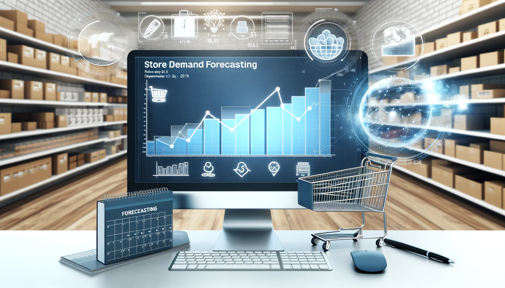
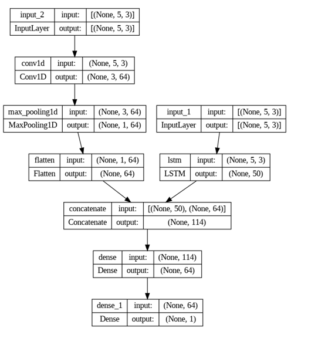

# 📈 Time Series Analysis Neural Network Sales Prediction

  

---

## 📌 Executive Summary

- Optimizing inventory is the backbone of modern retail operations.
- Accurate demand forecasting helps:
  - Prevent costly stockouts
  - Minimize overstock depreciation

- This project builds an **end-to-end predictive pipeline** that:
  - Ingests historical transactional data
  - Uses deep sequence neural networks
  - Forecasts item-level store demand

- Key Highlight:
  - Benchmarks traditional ML models vs advanced deep learning architectures
  - Establishes a **data-driven supply chain optimization framework**

---

## 🧰 Tech Stack

- **Language**
  - Python

- **Deep Learning**
  - TensorFlow
  - Keras (LSTM, CNN)

- **Machine Learning**
  - Scikit-learn
  - XGBoost

- **Data Processing**
  - Pandas
  - NumPy

- **Visualization**
  - Matplotlib
  - Seaborn

---

## 🎯 Strategic Objectives

- **Algorithm Benchmarking**
  - Compare:
    - ARIMA
    - XGBoost
    - Random Forest  
  - Against:
    - Bi-LSTM
    - CNN

- **Hybrid Architecture Design**
  - Combine:
    - CNN → Extract local patterns
    - LSTM → Capture temporal dependencies

- **Operational Scalability**
  - Build a pipeline scalable across:
    - Multiple stores
    - Multiple SKUs

---

## 📂 Data Architecture & Ingestion

- **Source**
  - Kaggle

- **Scale & Scope**
  - 5 years of data (Jan 2013 – Dec 2017)
  - 10 stores
  - 50 items

- **Core Features**
  - `Date` → Temporal anchor
  - `Store_ID` → Spatial anchor
  - `Item_ID` → Product anchor
  - `Sales` → Target variable

---

## ⚙️ Data Engineering & Pipeline

- **Temporal Feature Extraction**
  - Converted date into:
    - Day
    - Month
    - Year
  - Captures seasonality and trends

- **Categorical Encoding**
  - Label encoding applied to:
    - Store_ID
    - Item_ID

- **Quality Assurance**
  - Zero null values
  - Zero duplicate records

- **Sequential Splitting**
  - Train/Test split: **75/25**
  - Chronological split to:
    - Avoid data leakage
    - Simulate real-world forecasting

---

## 🧠 Model Architecture & Methodology

### 1️⃣ Baseline Models

- Random Forest Regressor
- XGBoost
- Artificial Neural Network (ANN)
- Convolutional Neural Network (CNN)
- ARIMA (Statistical baseline)

---

### 2️⃣ Advanced Temporal Models

- Long Short-Term Memory (LSTM)
- Bidirectional LSTM (Bi-LSTM)

---

### 3️⃣ Custom Hybrid Architectures

#### 🔹 LSTM + CNN Pipeline
- CNN extracts spatial/local features
- LSTM learns temporal dependencies

#### 🔹 BiLSTM + CNN Pipeline
- Uses bidirectional learning:
  - Past context
  - Future context
- Produces highly refined predictions

---

### ⚡ Hyperparameters

- Batch size: **256**
- Tuned manually for optimal performance

---

  

---

## 📊 Performance & Key Findings

- **Evaluation Metric**
  - Mean Squared Error (MSE)
  - Penalizes large prediction errors heavily

---

### 📉 Baseline Model Results

  

- Key Insight:
  - CNN outperformed:
    - XGBoost
    - ANN
  - Successfully captured local data patterns

---

### 📈 Deep Learning Model Results

  

- Key Insights:
  - Sequential models improved accuracy significantly
  - **Best Model:** BiLSTM + CNN Hybrid
  - Second Best: Bi-LSTM
  - Bidirectional learning reduced errors in volatile sales periods

---

## 🔭 Limitations & Future Scope

- Current limitation:
  - Uses only historical sales data

---

### 🚀 Future Improvements

- **Exogenous Features**
  - Add:
    - Weather data
    - Holidays
    - Economic indicators

- **Clustering Approach**
  - Use K-Means to:
    - Group stores by behavior
    - Reduce noise before training

---

## 💡 Conclusion

- Hybrid deep learning models outperform traditional ML models in time series forecasting
- BiLSTM + CNN provides:
  - Better temporal understanding
  - Improved prediction accuracy
- Strong potential for real-world retail and supply chain optimization

---

## ⭐ If you found this useful, consider giving this repo a star!
